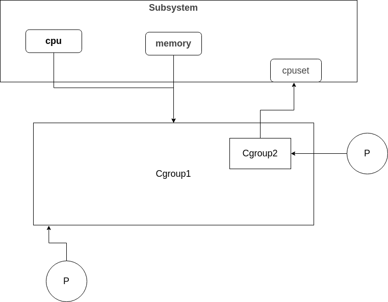

# How Docker (Moby) works
## 目录
- [How Docker (Moby) works](#how-docker-moby-works)
  - [目录](#目录)
  - [注](#注)
  - [Docker(Moby)是什么](#dockermoby是什么)
  - [从一个镜像到容器(以《自己动手写Docker》为例)](#从一个镜像到容器以自己动手写docker为例)
  - [容器技术](#容器技术)
    - [Namespace](#namespace)
    - [Cgroup](#cgroup)
    - [镜像](#镜像)
      - [什么是镜像](#什么是镜像)
      - [UFS(Union File System)](#ufsunion-file-system)
    - [网络](#网络)
      - [单主机网络](#单主机网络)
        - [虚拟网络设备](#虚拟网络设备)
          - [veth-pair](#veth-pair)
          - [bridge](#bridge)
      - [跨主机容器网络](#跨主机容器网络)
  - [总结](#总结)
## 注
**本文内容大部分来自于[《自己动手写Docker》](https://book.douban.com/subject/27082348/)，感谢 陈显鹭 王炳燊 秦妤嘉三位前辈的总结与讲解，让我对容器技术的“来龙”有了大概了解。**
## Docker(Moby)是什么
[Docker 是一个开放源代码软件，是一个开放平台，用于开发应用、交付（shipping）应用、运行应用。 Docker允许用户将基础设施（Infrastructure）中的应用单独分割出来，形成更小的颗粒（容器），从而提高交付软件的速度。  
Docker容器与虚拟机类似，但二者在原理上不同。容器是将操作系统层虚拟化，虚拟机则是虚拟化硬件，因此容器更具有便携性、高效地利用服务器。 容器更多的用于表示 软件的一个标准化单元。由于容器的标准化，因此它可以无视基础设施（Infrastructure）的差异，部署到任何一个地方。另外，Docker也为容器提供更强的业界的隔离兼容](https://zh.wikipedia.org/wiki/Docker)  
换言之，一个被隔离，被限制资源的进程就是一个docker容器。
## 从一个镜像到容器(以《自己动手写Docker》为例)
当你用 ``` docker run ``` 启动一个容器时，它会先通过namespace构造出一个隔离的容器运行空间，然后将镜像文件挂载在容器运行空间根目录下，然后再根据cgroup参数通过cgroup对容器进程做好限制，最后为容器添加虚拟网络设备让其与宿主机保持连通。  

[回到顶部](#目录)
## 容器技术
### Namespace
一个docker容器是宿主机上的一个进程，一个主机往往会有很多进程，如果不加以隔离和限制，很容易出现各个线程互相干扰的情况，而namespace技术就是用来对进程加以隔离的。其实在编程语言层面也有类似的隔离，就像在同一个项目的不同包下有相同命名的文件，但他们二者并不冲突。Namespace可以支持的隔离种类有很多：
1. **Mount Namespace：** 挂载点隔离，容器内看到的文件系统层次和外面不一样
2. **Pid Namespace：** 进程ID隔离，同一个进程在容器内外的ID不一样
3. **Network Namespace：** 隔离网络设备，容器不直接使用宿主机的网络设备，而是通过虚拟的网络设备与容器外通信。
4. **User Namespace：** 隔离容器内外的UID
5. **Uts Namespace：** 隔离nodename和domainname 两个系统标识。在 UTS Namespace里面，每个 Namespace 允许有自己的hostname
6. **IPC Namespace：** 进程通信隔离，这样只有同一个Namespace的进程才可以通信
7. **Time Namespace：** 时间隔离，容器内使用的时间可以和容器外不同
8. **Cgroup Namespace：** 控制组隔离，可以隐藏容器内进程真正控制组的位置。  
可以说，namespace让每个容器误以为它们独占整个操作系统，但实质上它就是宿主机上的一个进程。
### Cgroup
Cgroup的作用是对进程进行资源限制。Cgroup提供很多资源子系统来对系统资源进行限制(cpu,memory等)。在Cgroup中，资源控制以控制组(control group)为单位，每个控制组可以挂载多个资源子系统，这样才能对不同的资源进行限制；最后根据需求将进程添加到对应的控制组中，它的关系大致如下图：  
  
上图是根据cgroup v1所绘制的，可以看到，Cgroup之间有继承关系，子控制组也可以添加不同于父控制组的资源控制器，然后一个进程可以添加到不同的cgroup中，这样就会显得很混乱。  
所以cgroup v2就进行了改进：在v2中，所有controller都挂载于一个层级上，换言之，由一个父Group挂载所有的资源子系统，但是子group不一定能全部继承父group的全部资源控制器，只有父group中的cgroup.subtree_control包含的控制器才能继承，并且不能获得除这之外的控制器。并且在v2中，除了cgroup根节点以及叶子节点外，其他非叶子节点不能绑定进程。
### 镜像
如果说容器只是一个集装箱，那么镜像就是这个集装箱装载的物品。
#### 什么是镜像
**挂载在容器根目录上，用来为容器提供被隔离后的基础文件系统，这就是镜像，或者叫作：rootfs(根文件系统)。**  
一个镜像不只会包含应用本身，他还会包含这个应用所需要的运行环境文件，这样只要操作系统的内核适配，那么就可以直接pull这个镜像来运行，不需要进行繁杂的环境配置。  
docker在镜像文件系统结构上也做了创新,docker将镜像文件系统进行了分层，分别是只读层(镜像层)，可读写层(容器层)，init层。在镜像分层设计下，用户对容器的一切改变不会影响只读层，这一切变化会显示在可读写层(这一层在创造镜像的时候加入只读层)，init层(制造镜像时不会被加入镜像层)主要存储一些类似/etc/hosts、/etc/resolv.conf 这样的原本属于只读层，但特定环境下需要更改的文件。通过这样的设计，可以在同一宿主机上共用同一份镜像文件开启多个互不打扰的文件。之所一能做到这个，得益于联合文件系统(UFS)。
#### UFS(Union File System)
联合文件系统可以将不同位置的目录挂载于同一个目录下，在这个目录下，你可以对文件作出改动，并且这个改动不会影响那些read-only文件，对他们的改动会通过写时复制，复制他们来进行改动，在删除read-only文件时，会通过生成whiteout文件对他们进行遮挡并不会删除源文件。联合文件系统有很多种(AUFS,overlay,overlay2...)，但他们都支持上述的功能，这也docker选择它们的原因。  

[回到顶部](#目录)
### 网络
#### 单主机网络
Docker容器的网络系统有很多方案，有直接使用宿主机网络系统，也有通过虚拟网络设备与宿主机网络系统相连。  
##### 虚拟网络设备
###### veth-pair
veth-pair总是成对出现，从其中一端输入数据，另外一端就可接收数据。容器通过将veth的一段接入birdge来和外界通信。
###### bridge
bridge就像一个二层交换机，当请求到来时它会根据一定的规则选择广播或者转发。
#### 跨主机容器网络
跨主机网络通信通常有两种方案：
- 封包：
容器之间的请求外面包装上宿主机的地址发送，这样跨主机的容器之间的通信就转换成了宿主机之间的通信，到达另外一个容器所在的宿主机后再解开外面的包装，拿到真正的容器请求，就能实现跨主机的容器间通信了。Flannel的UDP，XVLAN就是这种方式。
- 路由：  
让宿主机的网络“知道”容器的地址要怎么路由、路由到哪台机器上，这种方式一般需要网络设备的支持，比如修改路由器的路由表，将容器 IP 地址的下一跳修改到这个容器所在的宿主机上，来送达跨主机容器间的请求。  

[回到顶部](#目录)

## 总结
docker最大的创新来自镜像的设计，但拆解到最后也都是linux内核中存在的技术，所以掌握好网络，操作系统真的很重要。