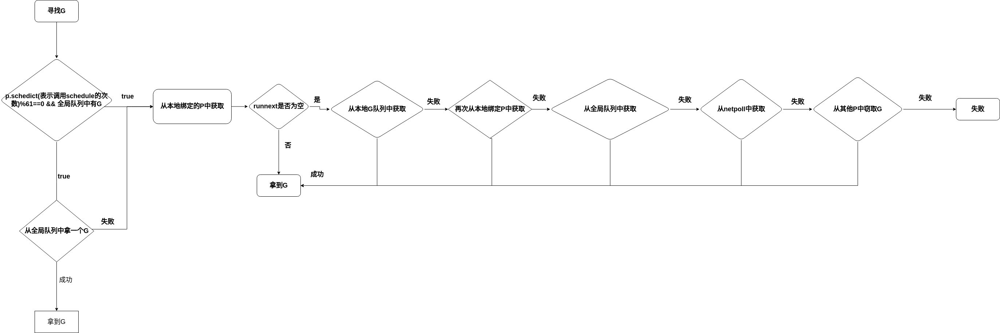

# concurrent programming in Go  


## 什么是并发编程  
并发是多个事件在同一时间间隔发生，而，而并发编程就是用编程语言来处理这个问题。
### 并发编程模型  
并发编程模型是对程序并发运行过程的抽象建模，也可以看作对并发编程的一种解决方案。在我所了解的语言中，Java1.8的并发编程模型是基于线程和内存同步访问控制的。而Go的并发编程模型以Goroutine(协程)和消息传递(channel)为主，当然Go也支持对内存的同步访问控制(sync)

## Goroutine
### 什么是goroutine  
goroutine就是所谓的协程，也就是我们常说的用户线程(既不是操作系统内核原生的线程)。他和内核线程的区别在于协程的“性价比”更高，因为协程的内存占用更小，创建销毁的成本也更小。  
### Go Scheduler
Go调度器是goroutine的核心，也是Go语言的核心之一。他负则统筹goroutine和内核线程的关系，合理安排gorountine的运行。它就是**GMP模型**的发动机。  
### GMP
G就是goroutine,M就是内核线程，P维护了一个可运行状态的goroutine队列。他们之间的关系如下图：  
  
可以看出，每一个M会绑定一个P，每个P对应n个G，那这样是不是可以说M和G的关系模型是1:n呢，不是，他们是m：n的关系，这是因为有调度器存在([调度机制](#调度机制非全部))。在这里我们还可以看到一个全局队列，他的作用也是存储G以供空闲的M获取。注意这里P不一定会与一直和一个M对应，当M阻塞时，他会被分配到其他线程上去。  
### 调度机制（非全部）  
流程如下图：  

这里可以看到，在运行过程中其实很少会从全局队列中获取G，因为它每次都要进行上锁，开销很大。在后续从其他队列偷取G时，还会先查看其他线程的状态，判断是否要继续窃取：  
```go
if _g_.m.spinning || 2*atomic.Load(&sched.nmspinning) < procs-atomic.Load(&sched.npidle) {
    .....
}
//m.spinning 表示m正在自旋寻找G
// nmspinning 表示处于自旋的M的数量
//procs表示P的总数，npidle表示空闲的P的数量
```
所以，当处于自旋的M数太多时，当前M就会放弃自旋，不给CPU造成太大压力。  
### 总结
goroutine确实是一个很好的设计，但是它也有它的缺点，比如它不能设置优先级在一些特定情况下，不能定制并发调度系统。  
## Channel  
### 什么是Channel  
Channel是一个Go基于[CSP](https://zh.m.wikipedia.org/zh-hans/%E9%80%9A%E4%BF%A1%E9%A1%BA%E5%BA%8F%E8%BF%9B%E7%A8%8B)实现的一个有锁循环队列，Goroutine可以发送数据到其中，也可以从中获取数据，就是不能更改队列中的数据。
### 相关操作   
**声明操作**
```go
//声明一个nil channel
var ch chan int

//声明一个无缓冲的channel
ch := make(chan int)

//声明一个有缓冲的channel
ch := make(chan int, 5)
```
**发送操作**
```go
//阻塞发送
ch <- 1

//非阻塞发送
select {
case ch <- 1:
    ....
default:
    ....
}
```
**接收操作**
```go
//阻塞发送
num := <- ch

//非阻塞发送
select {
case <- ch:
    ...
default:
    ...    
}
```
### 发送  
发送过程如下：  

### 接收  

### 关闭  
Channel的关闭就三条规则：  
1. **不能关闭已经关闭的channel**
2. **不能关闭为空的channel**
3. **释放发送与接收队列。**
### 总结  
channel专注于数据的流动，本身又是线程安全的，但channel并不是并发问题的最优解，在处理并发访问不流动的数据上，channel并不适合，所以在处理实际问题时不要盲目选择channel，也可以考虑使用同步锁。  
## 同步访问控制(sync)  
### sync.WaitGroup  
WaitGroup可以实现多个并发执行的代码块执行完，在继续向后运行的效果。它的工作原理就是维持一个运行计数（这个数代表等待执行的代码块数量），每当一个代码块执行完毕，主动发起运行完毕操作，运行技数减一，当运行计数等于0时，阻塞结束，继续执行下面的代码块。  
### sync.Map  
sync.Map是并发安全的，他的处理方式是读写分离，维护两个map，一个map(read)用来读，一个map(dirty)用来写，一般未命中read时，会加锁访问dirty，所以sync.Map的锁密度较大，不是很适合读少写多的情况。  
其实对于并发map的实现还有很多优秀的方案，像Java1.7采用分段锁实现，我们可以将一个大map划分成若干个小map，每次只操作对应的小map就可以了([对应实现](https://github.com/orcaman/concurrent-map))。