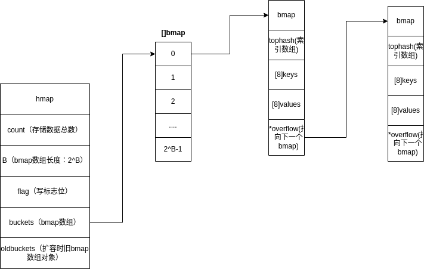

# map在Golang中的实现

## 环境
go version:1.18.1
ox: linux 5.15.0-47-generic
## 底层数据结构
Golang的map是基于散列表(hash table)实现的,其大致结构如下图：

go在map的空间占用上下了很大功夫，这一点从他bmap的设计就可以看出来。他并没有采用传用单个结构体存储单个key-value（就像java那样），而是将多个key-value挂载在一个bmap结构下，这个操作减少了对象数量，有利于内存空间管理；而且在同一个bmap中，k-v也不是以‘k-v/k-v/k-v’形式存储的，而是key，value单独存放的形式，其内存分布大致如下图：


这样做的好处是可以不用做内存对齐，减少空间浪费。

### hash冲突解决方式
采用hsah table方式实现map一定会遇到hash冲突，这里Go采用的方式为链地址法。

## 初始化
map的初始化方式有以下几种：
```GoLang
//不指定容量
make(map[int]int)
//指定容量
make(map[int]int, 8)
```
在不指定容量或这容量小于8时，会调用 makemap_small(),简单生成hash种子，然后其他属性再初始化；而指定了容量且大于8时，会调用makemap（），将大部分属性初始化。


## 定位

## 扩容

## 
