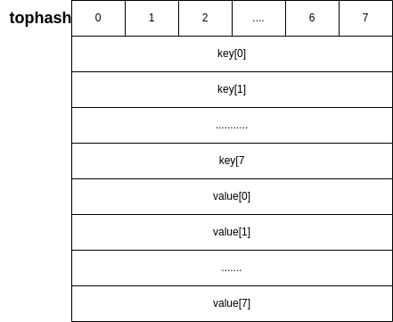

# map在Golang中的实现


**目录**
- [map在Golang中的实现](#map在golang中的实现)
  - [环境](#环境)
  - [底层数据结构](#底层数据结构)
    - [hash冲突解决方式](#hash冲突解决方式)
  - [初始化](#初始化)
  - [定位](#定位)
    - [桶定位](#桶定位)
    - [key定位（value定位）](#key定位value定位)
  - [扩容](#扩容)
    - [触发条件](#触发条件)
    - [扩容策略](#扩容策略)
  - [线程安全](#线程安全)
  - [总结](#总结)

## 环境
go version:1.18.1

ox: linux 5.15.0-47-generic
## 底层数据结构
Golang的map是基于散列表(hash table)实现的,其大致结构如下图：

go在map的空间占用上下了很大功夫，这一点从他bmap的设计就可以看出来。他并没有采用传用单个结构体存储单个key-value（就像java那样），而是将多个key-value挂载在一个bmap结构下，这个操作减少了对象数量，有利于内存空间管理；而且在同一个bmap中，k-v也不是以‘k-v/k-v/k-v’形式存储的，而是key，value单独存放的形式，其内存分布大致如下图：


这样做的好处是可以不用做内存对齐，减少空间浪费。

### hash冲突解决方式
采用hsah table方式实现map一定会遇到hash冲突，这里Go采用的方式为链地址法。

## 初始化
map的初始化方式有以下几种：
```GoLang
//不指定容量
make(map[int]int)
//指定容量
make(map[int]int, 8)
```
在不指定容量或这容量小于8时，会调用 makemap_small(),简单生成hash种子，然后其他属性再初始化；而指定了容量且大于8时，会调用makemap（），将大部分属性初始化。


## 定位
### 桶定位
主要代码：
```GoLang
    //定位所属bmap
    hash := t.hasher(key, uintptr(h.hash0))
    // m ：= uintptr(1) << h.B -1 
	m := bucketMask(h.B)
    //这一步取的是hash值的后B位
	b := (*bmap)(add(h.buckets, (hash&m)*uintptr(t.bucketsize)))
```
这里可以看到为什么buckets总数为2的幂次了，因为 在求b值的时候我们其实是在作一个求余运算，只不过是用&运算来实现，对于&运算我们知道，只有两个1相与才会等于一，而0与上0或1都为0。换句话说，与1相与自身不变，与0相与自身变0,所以在与0相与后，会丢失一些数永远都得不到。举个例子：
```
a = 14 ，对应的二进制为1110,那么像 1101, 0001这样的数再也得不到了。
```
### key定位（value定位）
主要代码：
```go
//这里将hash值左移了56位，所以最后只剩下原hash的前8位，所以我们可以看到key的位置由hash值的前8位决定
func tophash(hash uintptr) uint8 {
    //Ptrsize 就是单字节长度，64位为8,32为4
	top := uint8(hash >> (goarch.PtrSize*8 - 8))
	if top < minTopHash {
		top += minTopHash
	}
	return top
}
//key 定位
//dataOffset就是key相对于bmap的起始地址的偏移
k := add(unsafe.Pointer(b), dataOffset+i*uintptr(t.keysize))
//value定位
e := add(unsafe.Pointer(b), dataOffset+bucketCnt*uintptr(t.keysize)+i*uintptr(t.elemsize))
```
 
## 扩容
### 触发条件
主要代码：
```go
if !h.growing() && (overLoadFactor(h.count+1, h.B) || tooManyOverflowBuckets(h.noverflow, h.B)) {
		hashGrow(t, h)
		goto again 
	}

// 条件1
//count > 2^B * （13/2）
func overLoadFactor(count int, B uint8) bool {
	return count > bucketCnt && uintptr(count) > loadFactorNum*(bucketShift(B)/loadFactorDen)
}

//条件2
// 当B < 15 时，noverflow  >= 2^B
//B >= 15 时, noverflow >= 2^15
func tooManyOverflowBuckets(noverflow uint16, B uint8) bool {
	//noerflow表示扩展的bmap数目
	if B > 15 {
		B = 15
	}
    
	return noverflow >= uint16(1)<<(B&15)
}
```
条件2是为了处理大量插入数据，然后大量删除数据之后，不会触发条件一，但会创建很多overflow bucket，这样会导致key过于分散。既影响查找效率，还浪费大量空间。
### 扩容策略
1. 先将原buckets挂载在oldbuckets下
2. 根据不同的扩容条件生成新buckets
   1. 条件一：将容量扩充一倍
   2. 条件二：等量扩容
3. 搬迁：
    1. 条件一：重新计算hash值
    2. 条件二：不用计算hash值，直接按序号来搬
go的扩容是渐进的，一次扩容搬迁两个bmap链，这点和redis的hash扩容策略一样

## 线程安全
 Go map 不是线程安全的，在查找，赋值，删除过程中，都会检查写操作，如果发现当前正在执行写操作，就会直接panic。
 代码如下：
 ```go
 if h.flags&hashWriting != 0 {
		throw("concurrent map iteration and map write")
	}
 ```

## 总结
Go map 总体设计上是一个时间换空间的设计，也不支持多线程，所以在使用的时候需要多加小心。